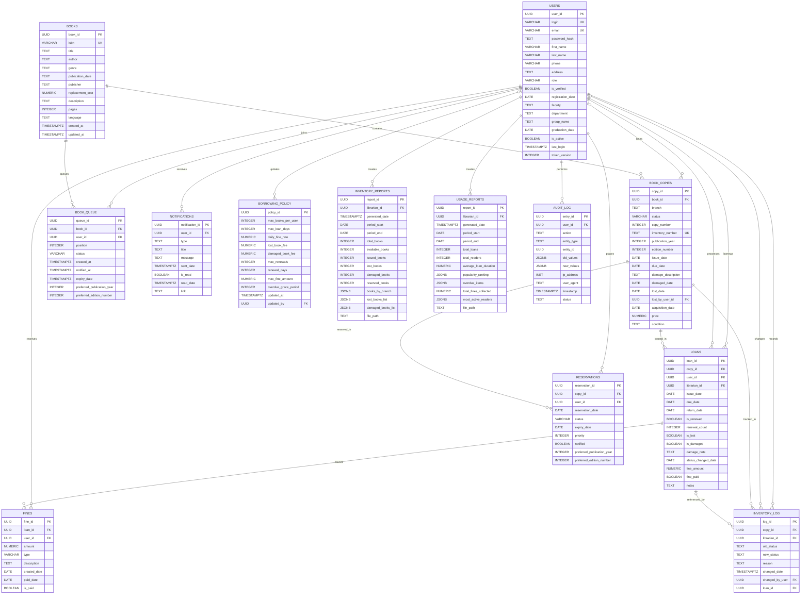

# Схема данных

Текущая реализация использует PostgreSQL. Источником исполняемой схемы до внедрения Alembic в ЛР3 является `app/core/database.py`; эта страница описывает её предметный смысл.

## Основные сущности

| Таблица | Назначение | Первичный ключ |
|---|---|---|
| `users` | читатели, библиотекари и администраторы | `user_id` |
| `books` | библиографические издания | `book_id` |
| `book_copies` | физические экземпляры изданий | `copy_id` |
| `loans` | история выдач и возвратов | `loan_id` |
| `fines` | начисленные штрафы | `fine_id` |
| `reservations` | бронирования конкретных экземпляров | `reservation_id` |
| `book_queue` | очередь читателей на издание | `queue_id` |
| `notifications` | сообщения пользователям | `notification_id` |
| `borrowing_policy` | правила выдачи и штрафов | `policy_id` |
| `inventory_log` | журнал состояния экземпляров | `log_id` |
| `audit_log` | журнал значимых действий | `entry_id` |
| `inventory_reports` | сохранённые инвентарные отчёты | `report_id` |
| `usage_reports` | сохранённые отчёты использования | `report_id` |

## Кардинальности и правила

- Одно издание имеет любое число физических экземпляров.
- При добавлении нового физического экземпляра сотрудник обязательно указывает год издания; номер издания необязателен. Экземпляры одной каталожной книги могут относиться к разным выпускам.
- Один экземпляр участвует во многих выдачах во времени, но одновременно должен иметь не более одной активной выдачи.
- Пользователь может иметь много выдач, броней, штрафов и уведомлений.
- Выдачу оформляет один библиотекарь для одного читателя.
- Штраф связан с выдачей, ставшей причиной начисления.
- Бронь относится к экземпляру, очередь — к изданию в целом.
- При заказе читатель может необязательно указать предпочтительные год и номер издания; эти параметры сохраняются и для непосредственной брони, и для очереди.

Справочные значения: роли `ADMIN`, `LIBRARIAN`, `STUDENT`, `EMPLOYEE`; состояния экземпляра `AVAILABLE`, `ISSUED`, `RESERVED`, `LOST`, `DAMAGED`; типы штрафов `OVERDUE`, `LOST_BOOK`, `DAMAGED_BOOK`.

Идентификаторы хранятся как `UUID`, логические значения как `BOOLEAN`, деньги как `NUMERIC(12,2)`, даты как `DATE`, события как `TIMESTAMPTZ`, структурированные отчёты как `JSONB`. Управляемые миграции схемы добавляются в ЛР3.
